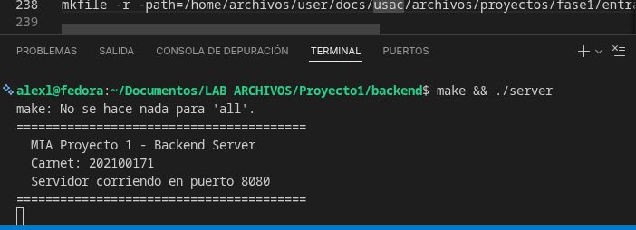
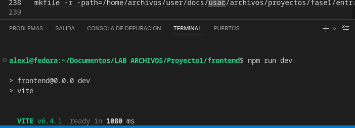
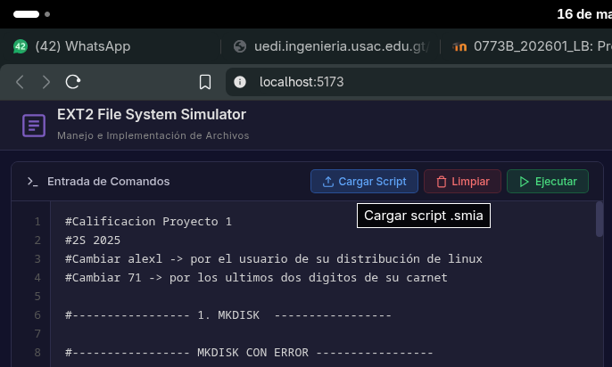
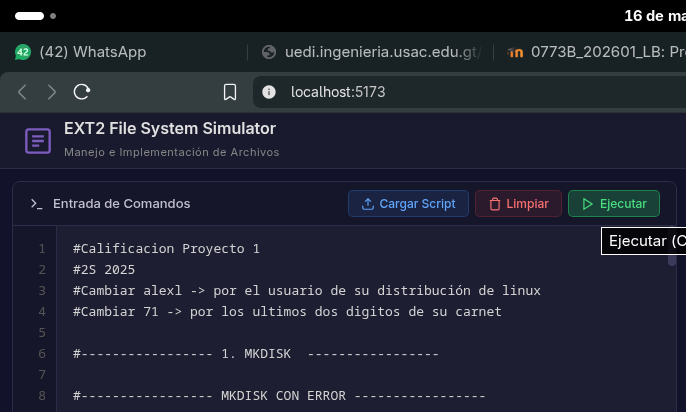
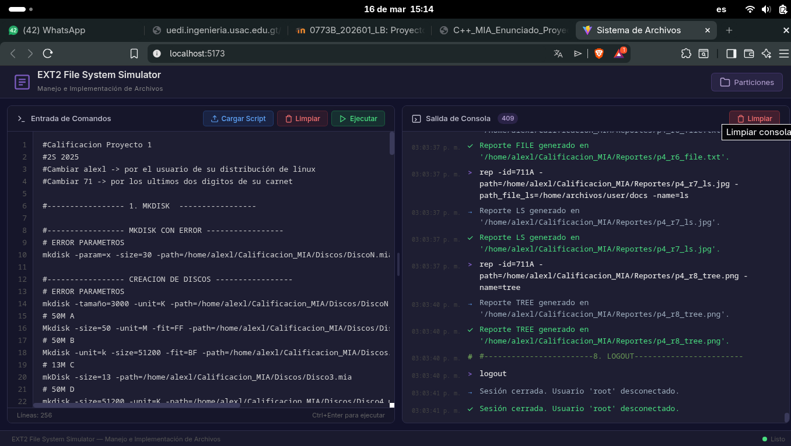
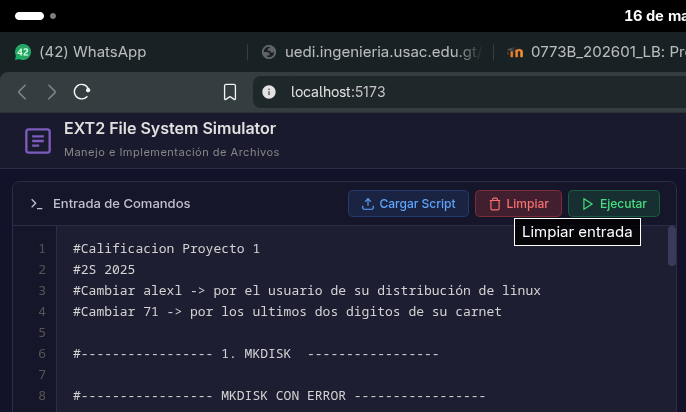
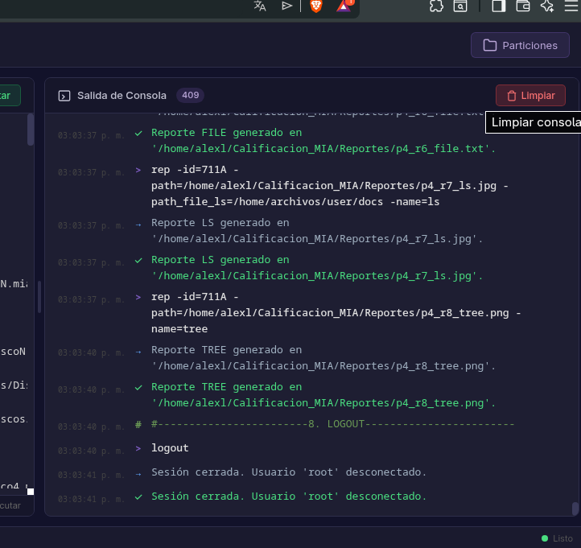
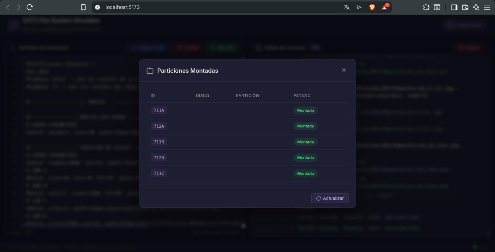

# Manual de Usuario - Proyecto1

## 1. Objetivo
Este manual explica como levantar el backend y frontend, usar la interfaz web y resolver problemas comunes.

## 2. Requisitos previos
- Sistema operativo Linux (recomendado) o similar.
- `g++` con soporte C++17.
- `make`.
- `node` y `npm`.
- Puerto `8080` disponible para backend.
- Puerto `5173` disponible para frontend (Vite usa este puerto por defecto, o uno cercano si esta ocupado).

## 3. Estructura importante del proyecto
- `backend/`: servidor HTTP en C++.
- `frontend/`: interfaz React + Vite.
- `img/`: capturas para este manual.
- `discos/`: archivos de disco de prueba.
- `reports/`: reportes generados.
- `*.smia`: scripts de comandos.

## 4. Levantar el backend
1. Abra una terminal en la carpeta `backend`.
2. Compile el servidor:

```bash
make
```

3. Ejecute el servidor:

```bash
./server
```

4. Verifique en consola un mensaje similar a: `Servidor corriendo en puerto 8080`.



## 5. Levantar el frontend
1. Abra otra terminal en la carpeta `frontend`.
2. Instale dependencias (solo la primera vez o cuando cambie `package.json`):

```bash
npm install
```

3. Inicie la aplicacion:

```bash
npm run dev
```

4. Abra en navegador la URL mostrada por Vite (normalmente `http://localhost:5173`).



## 6. Cargar un script `.smia`
1. En la seccion **Entrada de Comandos**, haga clic en **Cargar Script**.
2. Seleccione un archivo con extension `.smia`.
3. El contenido se cargara en el editor y aparecera un mensaje informativo en la consola.



## 7. Ejecutar comandos
1. Revise o escriba comandos en el editor de entrada.
2. Presione el boton **Ejecutar**.
3. Alternativamente, use el atajo de teclado `Ctrl+Enter`.
4. Espere a que finalice el estado **Ejecutando...**.



## 8. Revisar la salida de consola
1. Toda respuesta del backend aparece en el panel **Salida de Consola**.
2. Se mostraran entradas de comando, salida, errores, comentarios e informacion.
3. Revise el resultado para confirmar si cada instruccion fue exitosa.



## 9. Limpiar entrada de comandos
1. En el panel de entrada, haga clic en **Limpiar**.
2. El editor quedara vacio para escribir un nuevo bloque.



## 10. Limpiar salida de consola
1. En el panel de salida, haga clic en **Limpiar**.
2. Se eliminan todas las entradas mostradas en consola.



## 11. Ver particiones montadas
1. En la parte superior derecha, haga clic en el boton **Particiones**.
2. Se abrira una ventana/modal con la lista de particiones montadas.
3. Use esta vista para validar IDs montados antes de ejecutar comandos relacionados.



## 12. Flujo recomendado de uso
1. Levante backend y frontend.
2. Cargue un script `.smia` o escriba comandos manualmente.
3. Ejecute y revise la salida en consola.
4. Consulte particiones montadas cuando aplique.
5. Genere reportes y valide archivos en `reports/`.

## 13. Resolucion de problemas comunes

### Problema 1: `make && ./sever` falla con codigo 127
- Causa: el binario se llama `server`, no `sever`.
- Solucion:

```bash
cd backend
make
./server
```

### Problema 2: Frontend muestra error de conexion con backend
- Sintoma: mensaje tipo "Error de conexion con el backend".
- Causas posibles:
  - Backend apagado.
  - Puerto 8080 ocupado.
  - URL de API incorrecta.
- Solucion:
  1. Verifique que el backend este corriendo en `http://localhost:8080`.
  2. Si usa otra URL, configure `VITE_API_URL` en el frontend.
  3. Reinicie `npm run dev` despues del cambio.

### Problema 3: Puerto 8080 en uso
- Sintoma: backend no inicia o muestra error al escuchar el puerto.
- Solucion:
  1. Identifique proceso en Linux:

```bash
lsof -i :8080
```

  2. Cierre el proceso o cambie el puerto en backend y en `VITE_API_URL`.

### Problema 4: No se puede cargar un archivo script
- Causa: solo se aceptan archivos `.smia`.
- Solucion:
  1. Confirme extension exacta `.smia`.
  2. Evite extensiones dobles (ejemplo: `archivo.smia.txt`).

### Problema 5: El comando `execute -path=...` no abre el archivo
- Causas posibles:
  - Ruta incorrecta.
  - Archivo no existe.
  - Permisos insuficientes.
- Solucion:
  1. Verifique ruta absoluta real.
  2. Si la ruta tiene espacios, escribala entre comillas.
  3. Confirme permisos de lectura del archivo.

### Problema 6: `npm` o `node` no encontrados
- Sintoma: `command not found`.
- Solucion:
  1. Instale Node.js LTS.
  2. Verifique versiones:

```bash
node -v
npm -v
```

  3. Reabra terminal y ejecute `npm install`.

### Problema 7: La lista de particiones aparece vacia
- Causa: aun no hay particiones montadas.
- Solucion:
  1. Ejecute comandos para crear y montar particiones.
  2. Abra nuevamente el modal **Particiones**.

### Problema 8: Reportes no visibles en frontend
- Causas posibles:
  - El comando `rep` fallo.
  - El archivo de reporte no se genero.
  - Ruta del reporte invalida.
- Solucion:
  1. Revise salida de consola para ver error exacto.
  2. Confirme que el archivo existe en `reports/`.
  3. Reejecute `rep` con parametros correctos.

## 14. Comandos base de arranque rapido
```bash
# Terminal 1 - Backend
cd backend
make
./server

# Terminal 2 - Frontend
cd frontend
npm install
npm run dev
```

Con esto, el sistema queda listo para uso desde el navegador.
