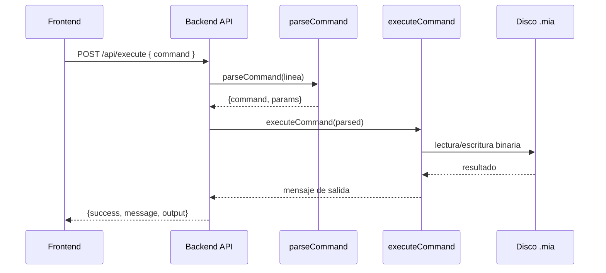
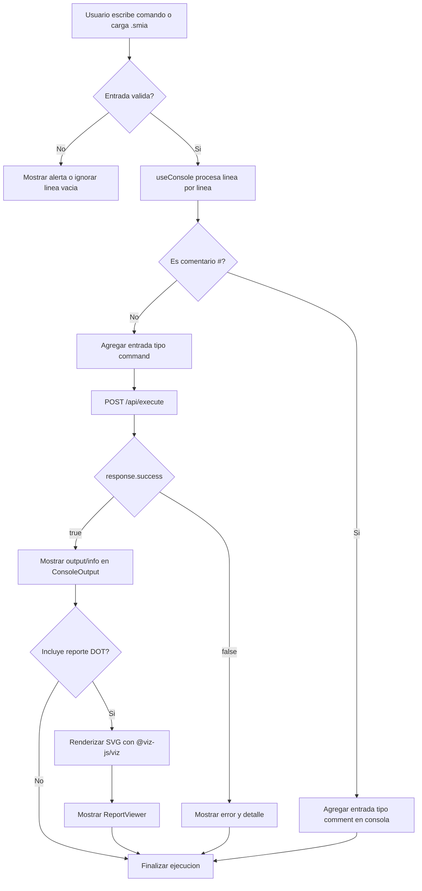
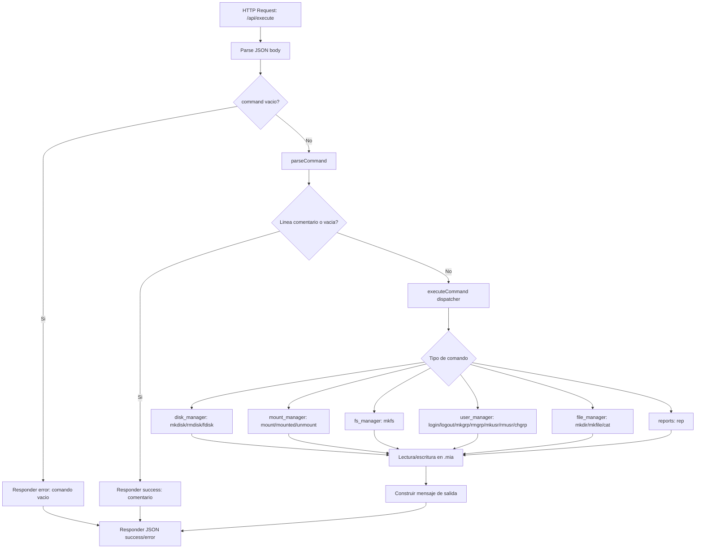
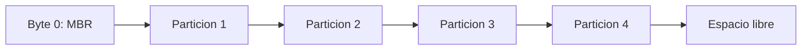
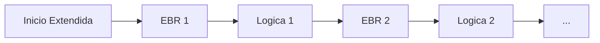

# Manual Tecnico - Sistema de Archivos EXT2 Simulado (Proyecto1)

## 1. Proposito
Este manual describe la arquitectura interna, estructuras de datos, comandos implementados y posibles mejoras del sistema de archivos EXT2 simulado en una aplicacion web con frontend React + backend C++.

## 2. Arquitectura del sistema

### 2.1 Vista general
El sistema esta dividido en dos capas principales:
- `frontend/` (React + TypeScript + Vite): interfaz de usuario para ingresar comandos, ver salida, consultar particiones montadas y visualizar reportes.
- `backend/` (C++17 + cpp-httplib): parser, ejecucion de comandos y persistencia en archivos binarios `.mia`.

### 2.2 Diagrama de componentes
```mermaid
flowchart LR
    U[Usuario] --> F[Frontend React]
    F -->|POST /api/execute| B[Backend C++]
    F -->|POST /api/execute-script| B
    F -->|GET /api/mounted| B
    F -->|GET /api/report| B

    B --> P[Parser]
    P --> C[Dispatcher de comandos]
    C --> D[disk_manager]
    C --> M[mount_manager]
    C --> FS[fs_manager]
    C --> UM[user_manager]
    C --> FM[file_manager]
    C --> R[reports]

    D --> DISK[(Archivo .mia)]
    M --> DISK
    FS --> DISK
    UM --> DISK
    FM --> DISK
    R --> DISK
    R --> OUT[(reports/*.dot|png|svg|txt)]
```

### 2.3 Flujo de ejecucion de un comando


### 2.4 Endpoints HTTP implementados
- `POST /api/execute`: ejecuta un comando individual.
- `POST /api/execute-script`: ejecuta multiples lineas de script en una sola solicitud.
- `GET /api/mounted`: devuelve lista de particiones montadas en memoria.
- `GET /api/report?path=...`: devuelve archivo de reporte (svg/png/jpg/pdf/txt).

### 2.5 Diagrama de flujo del frontend


### 2.6 Diagrama de flujo del backend


### 2.7 Diagrama de flujo integrado (Frontend + Backend)
```mermaid
flowchart LR
  U[Usuario] --> FE[Frontend]
  FE -->|POST /api/execute| BE[Backend]
  BE --> PARSE[Parser + Dispatcher]
  PARSE --> MOD[Modulo de comando]
  MOD --> DISK[(Disco .mia)]
  MOD --> REP[(reports/*.dot|png|svg|txt)]
  MOD --> RESP[Resultado JSON]
  RESP --> FE
  FE --> CONS[ConsoleOutput]
  FE --> VIEW[ReportViewer/Modal]
```

## 3. Estructuras de datos internas

Las estructuras estan definidas en `backend/src/structures.h` y se escriben/leen directamente desde el archivo binario `.mia`.

### 3.1 Estructuras de particionado
- `MBR`:
  - Metadatos del disco: tamano total, fecha de creacion, firma, fit global.
  - Contiene 4 entradas `Partition`.
- `Partition`:
  - `part_status`, `part_type` (P/E), `part_fit`, `part_start`, `part_size`, `part_name`.
  - `part_correlative` y `part_id` se usan durante montaje (primarias/extendidas).
- `EBR`:
  - Describe particiones logicas dentro de una particion extendida.
  - Cadena enlazada con `part_next`.

### 3.2 Estructuras EXT2
- `Superblock`:
  - Contadores de inodos/bloques, libres, offsets de bitmaps, tabla de inodos y area de bloques.
  - `s_magic = 0xEF53`, `s_filesystem_type = 2`.
- `Inode`:
  - Owner (`i_uid`, `i_gid`), tamano, tiempos, permisos y punteros `i_block[15]`.
  - 12 directos + indirecto simple + doble + triple.
- Bloques:
  - `DirBlock` (carpetas): 4 entradas `DirContent`.
  - `FileBlock` (archivos): 64 bytes de contenido.
  - `PointerBlock`: 16 punteros a otros bloques.

### 3.3 Estructura de montaje en runtime
- `MountedPart`:
  - ID de montaje, path del disco, nombre de particion, `part_start`.
  - Estado de sesion actual (`logged_in`, `current_user`, `current_uid`, `current_gid`).
- Esta estructura vive en memoria (no se persiste completa en disco).

## 4. Organizacion del archivo binario `.mia`

### 4.1 Layout de disco a nivel MBR/particiones


Para particion extendida:


### 4.2 Layout de una particion formateada EXT2
En `mkfs`, la particion queda organizada asi:
```text
[Superblock][Bitmap Inodos][Bitmap Bloques][Tabla Inodos][Area de Bloques]
```

Calculo de inodos:
```text
n = floor((partSize - sizeof(Superblock)) / (1 + 3 + sizeof(Inode) + 3*sizeof(FileBlock)))
inodos = n
bloques = 3*n
```

Inicializacion por defecto de `mkfs`:
- Inodo 0: `/` (raiz).
- Inodo 1: `users.txt`.
- Contenido inicial `users.txt`:
  - `1,G,root`
  - `1,U,root,root,123`

## 5. Parser y normalizacion de comandos

El parser (`backend/src/parser.h`) aplica estas reglas:
- Comandos y claves de parametros son case-insensitive (se convierten a minuscula).
- Formato esperado: `comando -key=value`.
- Valores con espacios deben ir entre comillas: `-path="/ruta con espacios/archivo.mia"`.
- Lineas vacias y comentarios (`# ...`) no ejecutan accion.

## 6. Comandos implementados (descripcion tecnica)

## 6.1 Administracion de discos y particiones

### `mkdisk`
- Objetivo: crear archivo de disco binario y escribir MBR inicial.
- Parametros:
  - Obligatorios: `-size`, `-path`
  - Opcionales: `-fit={bf|ff|wf}` (default `ff`), `-unit={k|m}` (default `m`)
- Efecto interno:
  - Reserva archivo con bytes en cero.
  - Escribe `MBR` en byte 0.
- Ejemplo:
```txt
mkdisk -size=20 -unit=M -fit=FF -path="/home/alexl/Documentos/LAB ARCHIVOS/Proyecto1/discos/DiscoA.mia"
```

### `rmdisk`
- Objetivo: eliminar archivo de disco.
- Parametros: obligatorio `-path`.
- Efecto interno: borra el archivo del host OS.
- Ejemplo:
```txt
rmdisk -path="/home/alexl/Documentos/LAB ARCHIVOS/Proyecto1/discos/DiscoA.mia"
```

### `fdisk`
- Objetivo: crear o eliminar particiones primarias, extendidas o logicas.
- Parametros (creacion):
  - Obligatorios: `-size`, `-path`, `-name`
  - Opcionales: `-unit={b|k|m}` (default `k`), `-type={p|e|l}` (default `p`), `-fit={bf|ff|wf}` (default `wf`)
- Parametros (eliminacion): `-path`, `-name`, `-delete`
- Efecto interno:
  - Primaria/extendida: actualiza entrada `Partition` en MBR.
  - Extendida: crea EBR inicial vacio.
  - Logica: administra cadena `EBR` dentro de la extendida.
- Ejemplo:
```txt
fdisk -size=5 -unit=M -type=P -fit=WF -name=Part1 -path="/home/alexl/Documentos/LAB ARCHIVOS/Proyecto1/discos/DiscoA.mia"
```

## 6.2 Montaje y formato

### `mount`
- Objetivo: montar una particion por `path+name` y generar ID de montaje.
- Parametros obligatorios: `-path`, `-name`.
- Efecto interno:
  - Agrega entrada a `MountedPart` en memoria.
  - Para particiones MBR, escribe `part_correlative` y `part_id`.
- Ejemplo:
```txt
mount -path="/home/alexl/Documentos/LAB ARCHIVOS/Proyecto1/discos/DiscoA.mia" -name=Part1
```

### `mounted`
- Objetivo: listar particiones montadas actuales.
- Parametros: ninguno.
- Efecto interno: lectura del vector global de montaje.
- Ejemplo:
```txt
mounted
```

### `unmount`
- Objetivo: desmontar una particion por ID.
- Parametros obligatorios: `-id`.
- Efecto interno:
  - Elimina entrada `MountedPart`.
  - Limpia `part_correlative` y `part_id` en MBR (si aplica).
- Ejemplo:
```txt
unmount -id=711A
```

### `mkfs`
- Objetivo: formatear la particion montada a EXT2.
- Parametros:
  - Obligatorio: `-id`
  - Opcional: `-type` (default `full`)
- Efecto interno:
  - Limpia area de particion.
  - Escribe `Superblock`, bitmaps, inodos y bloques iniciales.
  - Crea raiz y `users.txt`.
- Ejemplo:
```txt
mkfs -id=711A -type=full
```

## 6.3 Sesiones, grupos y usuarios

### `login`
- Objetivo: autenticar usuario contra `users.txt`.
- Parametros obligatorios: `-user`, `-pass`, `-id`.
- Efecto interno:
  - Marca sesion activa en `MountedPart`.
  - Restriccion actual: solo 1 sesion global simultanea.
- Ejemplo:
```txt
login -user=root -pass=123 -id=711A
```

### `logout`
- Objetivo: cerrar sesion activa.
- Parametros: ninguno.
- Efecto interno: limpia estado de sesion en memoria.
- Ejemplo:
```txt
logout
```

### `mkgrp`
- Objetivo: crear grupo en `users.txt`.
- Parametros obligatorios: `-name`.
- Requiere: sesion `root`.
- Efecto interno: agrega linea `ID,G,nombre`.
- Ejemplo:
```txt
mkgrp -name=devs
```

### `rmgrp`
- Objetivo: eliminar grupo logicamente.
- Parametros obligatorios: `-name`.
- Requiere: sesion `root`.
- Efecto interno: marca grupo con ID `0` (borrado logico).
- Ejemplo:
```txt
rmgrp -name=devs
```

### `mkusr`
- Objetivo: crear usuario.
- Parametros obligatorios: `-user`, `-pass`, `-grp`.
- Requiere: sesion `root`, grupo existente, `user/pass <= 10` caracteres.
- Efecto interno: agrega linea `ID,U,grupo,usuario,pass`.
- Ejemplo:
```txt
mkusr -user=alex -pass=123 -grp=root
```

### `rmusr`
- Objetivo: eliminar usuario logicamente.
- Parametros obligatorios: `-user`.
- Requiere: sesion `root`.
- Efecto interno: marca usuario con ID `0`.
- Ejemplo:
```txt
rmusr -user=alex
```

### `chgrp`
- Objetivo: cambiar grupo de un usuario.
- Parametros obligatorios: `-user`, `-grp`.
- Requiere: sesion `root`, grupo destino existente.
- Efecto interno: reescribe la linea del usuario en `users.txt`.
- Ejemplo:
```txt
chgrp -user=alex -grp=devs
```

## 6.4 Archivos y directorios

### `mkdir`
- Objetivo: crear directorios.
- Parametros:
  - Obligatorio: `-path`
  - Opcional: `-r` o `-p` para creacion recursiva
- Requiere: sesion activa.
- Efecto interno:
  - Reserva inodos/bloques de carpeta.
  - Crea entradas `.` y `..`.
  - Inserta entrada en directorio padre.
- Ejemplo:
```txt
mkdir -path="/home/proyectos/docs" -p
```

### `mkfile`
- Objetivo: crear o sobrescribir archivos.
- Parametros:
  - Obligatorio: `-path`
  - Opcionales: `-r`, `-size`, `-cont`
- Requiere: sesion activa.
- Efecto interno:
  - Crea inodo de archivo si no existe.
  - Escribe contenido en bloques directos e indirectos (simple/doble/triple).
  - Si existe, actualiza contenido.
- Ejemplo:
```txt
mkfile -path="/home/proyectos/docs/nota.txt" -size=120 -r
```

### `cat`
- Objetivo: mostrar contenido de archivos.
- Parametros:
  - `-file` o `-file1 ... -file20`
- Requiere: sesion activa.
- Efecto interno: recorre arbol de directorios e inodos para lectura.
- Ejemplo:
```txt
cat -file1="/home/proyectos/docs/nota.txt"
```

## 6.5 Scripts y reportes

### `execute`
- Objetivo: ejecutar comandos desde un archivo `.smia` del host.
- Parametros obligatorios: `-path`.
- Efecto interno: lee archivo, parsea por linea y despacha cada comando.
- Ejemplo:
```txt
execute -path="/home/alexl/Documentos/LAB ARCHIVOS/Proyecto1/test_full.smia"
```

### `rep`
- Objetivo: generar reportes de estructuras.
- Parametros:
  - Obligatorios: `-name`, `-path`, `-id`
  - Opcional: `-ruta` (o `-path_file_ls`) para `file` y `ls`
- Tipos de reporte soportados:
  - `mbr`, `disk`, `inode`, `block`, `bm_inode`, `bm_block`, `tree`, `sb`, `file`, `ls`
- Efecto interno:
  - Construye contenido DOT/texto.
  - Ejecuta `dot` (Graphviz) para formatos graficos cuando aplica.
- Ejemplo:
```txt
rep -name=tree -path="/home/alexl/Documentos/LAB ARCHIVOS/Proyecto1/reports/tree_report.png" -id=711A
```

## 7. Integracion frontend-backend

## 7.1 Frontend
- `useConsole.ts` procesa entrada linea por linea y consume `POST /api/execute` por cada comando.
- `CommandInput` soporta:
  - carga de scripts `.smia`
  - `Ctrl+Enter` para ejecutar
  - limpieza de entrada
- `ConsoleOutput` clasifica salidas por tipo: `command`, `output`, `error`, `comment`, `info`.
- `MountedModal` consulta `GET /api/mounted`.
- `ReportViewer` renderiza SVG de DOT generado en cliente.

## 7.2 Backend
- `main.cpp` define API REST y CORS abierto.
- `executeCommand` actua como dispatcher central.
- Modulos en headers (`inline`) encapsulan cada dominio funcional.

## 8. Efectos de comandos sobre estructuras internas

Resumen de impacto principal:
- `mkdisk`: crea archivo y MBR.
- `fdisk`: modifica MBR/EBR y mapa de particiones.
- `mount/unmount`: actualiza estado de montaje en memoria y campos de identificacion en MBR (primarias).
- `mkfs`: crea estructura EXT2 completa (SB, bitmaps, inodos, bloques).
- `mkgrp/mkusr/rmgrp/rmusr/chgrp`: modifican contenido de `users.txt`.
- `mkdir/mkfile`: asignan inodos/bloques y actualizan directorios padre.
- `cat`: lectura de inodos y bloques sin alterar contenido.
- `rep`: lectura de metadatos/contenido y emision de reportes.

## 9. Limitaciones tecnicas actuales
- Sesion unica global (no multiusuario concurrente real).
- Frontend ejecuta scripts linea por linea con `/api/execute`; no aprovecha por defecto `/api/execute-script`.
- No hay journal (EXT3) ni recuperacion ante fallos.
- No hay capas de pruebas automatizadas visibles en este modulo.
- Parser simple (no soporta variantes avanzadas de sintaxis).

## 10. Posibles mejoras al proyecto

1. Mejorar concurrencia y sesiones
- Soportar multiples sesiones por particion/usuario con tokens.
- Control de bloqueo por inodo para evitar condiciones de carrera.

2. Robustecer parser y validaciones
- Validacion semantica de parametros antes de ejecutar.
- Mensajes de error estandarizados con codigos.

3. Optimizar API y frontend
- Ejecutar bloques via `POST /api/execute-script` para reducir round-trips.
- Agregar historial persistente de comandos y filtros en consola.

4. Fortalecer seguridad
- Hash de contrasenas en `users.txt` en lugar de texto plano.
- Restricciones CORS configurables por entorno.

5. Mejorar modelo EXT2
- Reutilizacion de inodos/bloques liberados con politicas de asignacion.
- Implementar operaciones de eliminacion fisica y compactacion.
- Agregar soporte extendido de permisos y ownership.

6. Reporteria avanzada
- Reportes comparativos antes/despues de un comando.
- Exportacion directa a PDF/ZIP de todos los reportes de una ejecucion.

7. Calidad de software
- Pruebas unitarias para parser y comandos criticos.
- Pruebas de integracion API + disco temporal.
- CI en GitHub Actions con compilacion y validaciones.

## 11. Referencias de implementacion
- Backend principal: `backend/src/main.cpp`
- Estructuras: `backend/src/structures.h`
- Parser: `backend/src/parser.h`
- Discos/particiones: `backend/src/disk_manager.h`
- Montaje: `backend/src/mount_manager.h`
- Formateo EXT2: `backend/src/fs_manager.h`
- Usuarios: `backend/src/user_manager.h`
- Archivos/directorios: `backend/src/file_manager.h`
- Reportes: `backend/src/reports.h`
- API frontend: `frontend/src/services/api.ts`
- Consola frontend: `frontend/src/hooks/useConsole.ts`
